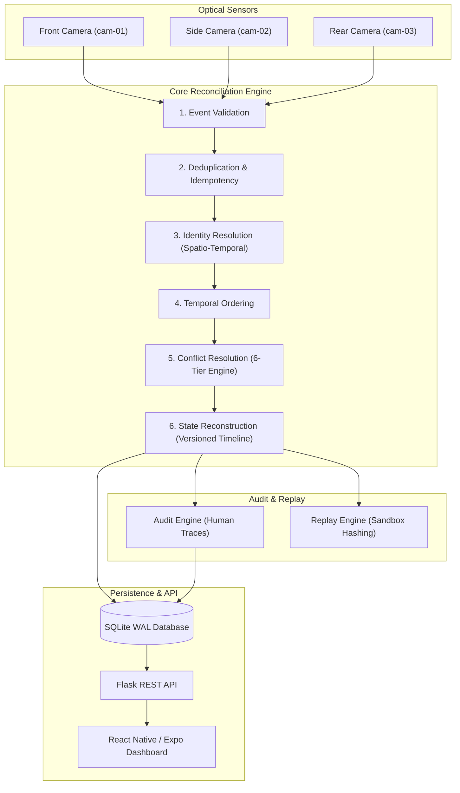

# EngageResolve Architecture Specification

## Overview

EngageResolve is a real-time, deterministic engagement conflict resolution engine designed for AI-powered classroom monitoring. It receives asynchronous engagement events from multiple optical cameras, resolves conflicting observations, reconciles out-of-order and duplicate signals, matches student identities, reconstructs versioned student timelines, and generates human-readable decision traces and side-effect-free replay verification hashes.

## Architecture Diagram

## System Components

### 1. Ingestion & Validation (`app/core/validation.py`)
Validates incoming camera payload schemas:
- `0.0 <= engagement_score <= 1.0`
- `0.0 <= confidence <= 1.0`
- Timestamps must be valid ISO-8601 UTC strings.
- Non-empty camera and student IDs.

### 2. Event Fingerprinting & Idempotency (`app/core/fingerprint.py`)
Computes a canonical SHA-256 hash for fields: `(camera_id, timestamp, student_id, engagement_score, confidence, source)`. Duplicate submissions return standard idempotent responses without mutating student states or generating duplicate audit logs.

### 3. Spatio-Temporal Identity Resolution (`app/core/identity_resolution.py`)
Resolves raw camera student IDs to canonical student records using spatio-temporal scoring:
$$\text{temporal\_score} = 1 - \min\left(\frac{\Delta t}{\text{TIME\_WINDOW}}, 1.0\right)$$
$$\text{spatial\_score} = 1 - \min\left(\frac{\text{distance}}{\text{MAX\_DISTANCE}}, 1.0\right)$$
$$\text{combined\_score} = 0.6 \cdot \text{temporal\_score} + 0.4 \cdot \text{spatial\_score}$$
If $\text{combined\_score} \ge 0.70$, maps to the existing canonical student.

### 4. 6-Tier Conflict Resolution Engine (`app/core/conflict_resolution.py`)
1. **Validity**: Reject malformed events.
2. **Deduplication**: Ignore exact fingerprint matches.
3. **Confidence**: Higher confidence score wins.
4. **Timestamp**: Earlier timestamp wins if confidence is equal.
5. **Camera Reliability**: Higher camera reliability score wins (`front_camera`: 0.95, `side_camera`: 0.85, `rear_camera`: 0.80).
6. **Fingerprint Tie-breaker**: Lexicographically smaller SHA-256 fingerprint string.

### 5. Out-of-Order Timeline Reconstruction (`app/core/state_reconstruction.py`)
When a late event arrives prior to the latest state timestamp, the engine re-fetches all events for the student, re-sorts them chronologically, re-assigns version numbers ($v_1, v_2, v_3 \dots$), and logs an `OUT_OF_ORDER_EVENT` audit record.

### 6. Side-Effect-Free Replay Engine (`app/core/replay_engine.py`)
Re-processes historical event ranges in an isolated in-memory SQLite sandbox. Generates a canonical result SHA-256 hash of student states and audit logs to verify 100% determinism.

### 7. Power BI CSV Exports (`app/api/exports.py`)
Generates Power BI-compatible CSV files (`engagement_timeline.csv` and `audit_log.csv`) directly from SQLite queries.
